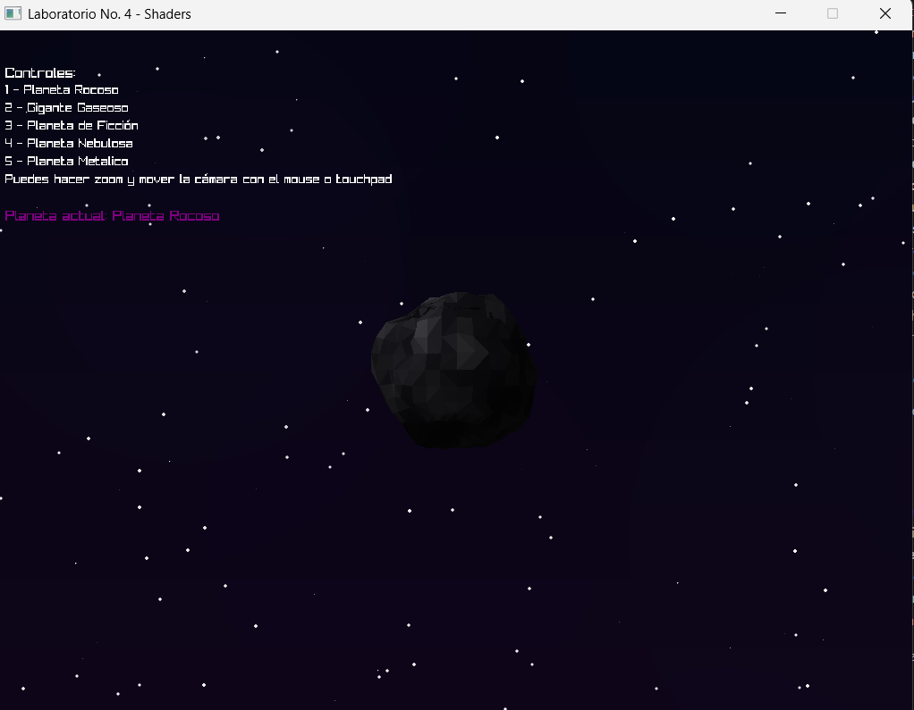
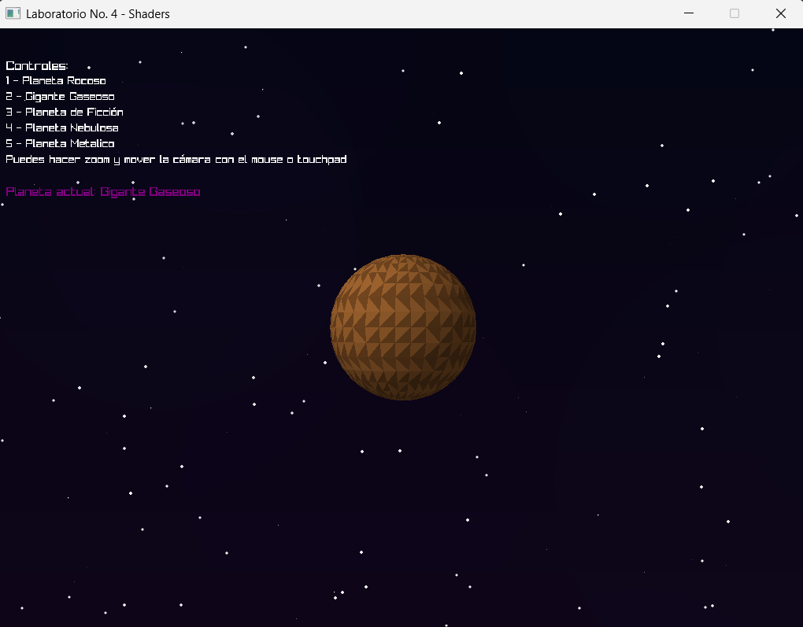
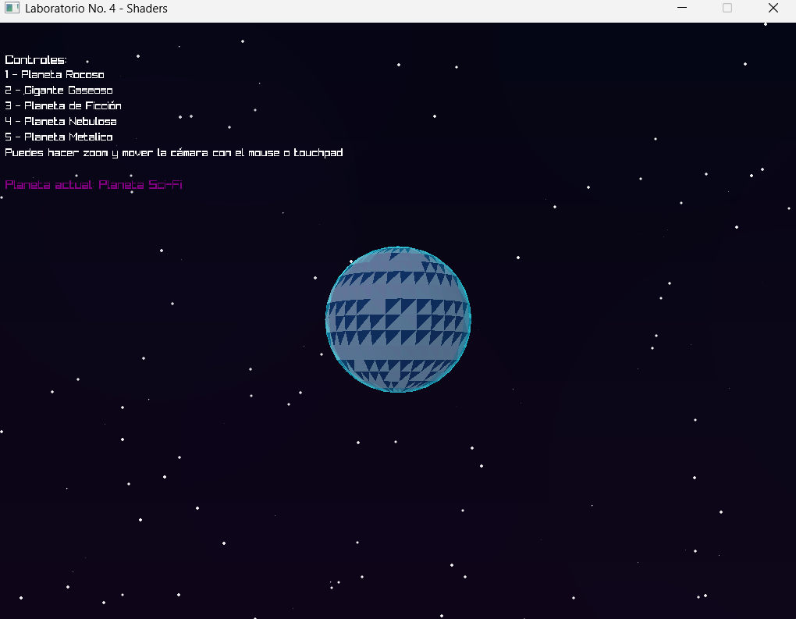
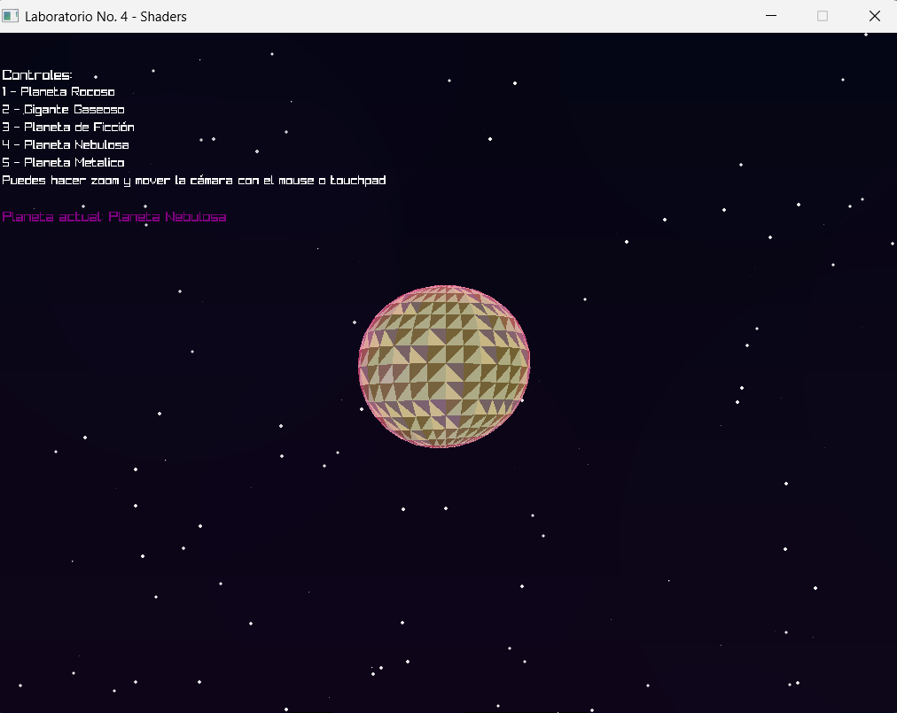
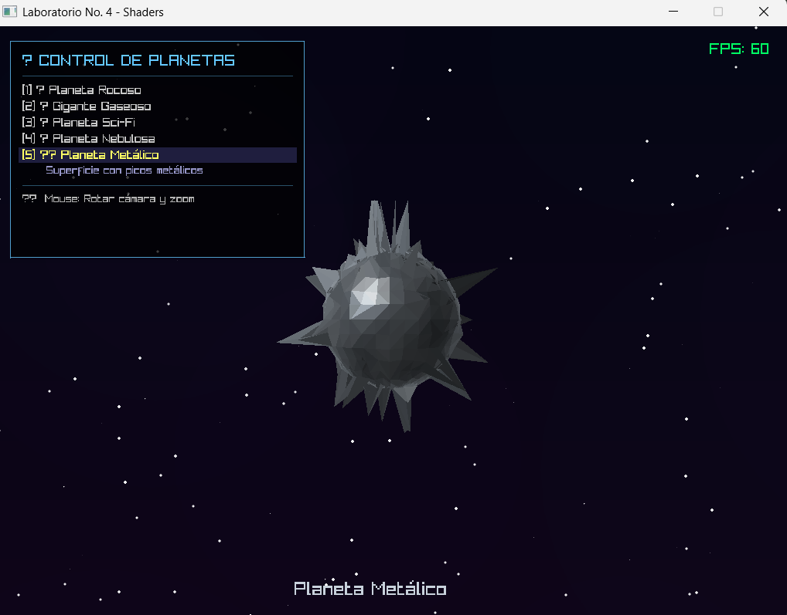

# 🌍 Lab4 - Static Shaders: Sistema de Planetas Procedurales

**Laboratorio de Gráficas por Computadora**  
*Generación procedural de planetas usando shaders personalizados en Rust*

---

## 🚀 Descripción del Proyecto

Este proyecto implementa un sistema de renderizado de planetas procedurales usando **shaders personalizados** escritos completamente en Rust. Cada planeta se genera mediante algoritmos de ruido sin usar texturas pregrabadas.

**Tecnologías:**
- **Rust** - Lenguaje de programación
- **Raylib 5.0** - Framework gráfico
- **Renderizado por Software** - Pipeline completo sin GPU shaders
- **Generación Procedural** - Algoritmos de ruido (Perlin, FBM, Voronoi, Ridge)
- **5 Planetas Únicos** - Cada uno con efectos especiales diferentes

---

## 📸 Capturas de Pantalla

### Planeta 1: Rocoso Gris con Relieve Procedural



*Presiona tecla **1** para ver este planeta*

**Características:**
- Deformación geométrica procedural (montañas, colinas, cráteres)
- Paleta de 7 tonos de gris
- Fracturas y vetas minerales
- 5 capas de deformación en vertex shader

---

### Planeta 2: Gigante Gaseoso (Júpiter)



*Presiona tecla **2** para ver este planeta*

**Características:**
- 14 bandas atmosféricas horizontales con textura visible
- Gran Mancha Roja con rotación espiral interna
- Turbulencia multicapa (corrientes de chorro, remolinos, nubes finas)
- Óvalos blancos (tormentas menores)
- Colores variados: marrón oscuro → naranja → beige → crema → blanco

---

### Planeta 3: Sci-Fi Tecnológico



*Presiona tecla **3** para ver este planeta*

**Características:**
- Patrón hexagonal de circuitos
- Líneas de escaneo animadas
- Glitches aleatorios y pulsos de energía
- Paleta cibernética (azul, cian, púrpura, rosa neón)

---

### Planeta 4: Nebulosa Cósmica



*Presiona tecla **4** para ver este planeta*

**Características:**
- Ondas de choque expansivas
- Vórtices energéticos
- Paleta cósmica (púrpura, magenta, naranja, cian)
- Auto-iluminación (emisivo puro)

---

### Planeta 5: Metálico con Picos



*Presiona tecla **5** para ver este planeta*

**Características:**
- Picos/púas procedurales por toda la superficie (prickles)
- Apariencia metálica cromada (plata, acero, cromado)
- 5 capas de deformación en vertex shader (Voronoi)
- Iluminación especular intensa
- Reflexiones metálicas realistas

---

## ✨ Características Principales

- ✅ **Vertex Shaders** - Deformación procedural de geometría
- ✅ **Fragment Shaders** - Coloreado y texturizado por píxel
- ✅ **5 Planetas Únicos** - Cada uno con efectos especiales diferentes
- ✅ **Fondo Espacial** - Galaxia con estrellas animadas y nebulosas
- ✅ **Iluminación Realista** - Difusa, especular, rim lighting, fresnel
- ✅ **100% Procedural** - Sin texturas pregrabadas
- ✅ **Generación de Geometría** - Picos y deformaciones en tiempo real

---

## 🎮 Cómo Ejecutar el Programa

### Requisitos Previos

- **Rust** instalado (https://www.rust-lang.org/tools/install)
- **Git** para clonar el repositorio

### Instalación

```bash
# Clonar repositorio
git clone https://github.com/hadelacruz/Lab4-Static-Shaders.git
cd Lab4-Static-Shaders

# Compilar
cargo build --release

# Ejecutar
cargo run --release
```
---

## 🎮 Controles

| Tecla | Acción |
|-------|--------|
| **1** | Ver Planeta Rocoso |
| **2** | Ver Gigante Gaseoso (Júpiter) |
| **3** | Ver Planeta Sci-Fi |
| **4** | Ver Planeta Nebulosa |
| **5** | Ver Planeta Metálico |
| **ESC** | Salir |

---

## 🏗️ Arquitectura del Sistema

### Estructura del Proyecto

```
Lab4-Static-Shaders/
├── src/
│   ├── main.rs              # Loop principal y fondo espacial
│   ├── shaders.rs           # Base de shaders y funciones de ruido
│   ├── planets/             # Shaders de planetas (5 módulos)
│   │   ├── mod.rs           # Coordinador de módulos
│   │   ├── rocky.rs         # Planeta rocoso con relieve
│   │   ├── gas_giant.rs     # Gigante gaseoso (Júpiter)
│   │   ├── crystal.rs       # Planeta sci-fi tecnológico
│   │   ├── nebula.rs        # Nebulosa cósmica
│   │   └── metallic.rs      # Planeta metálico con picos
│   ├── orbital_camera.rs    # Cámara orbital interactiva
│   ├── transform.rs         # Matrices de transformación 4x4
│   ├── sphere.rs            # Cargador de modelos OBJ
│   ├── sphere.obj           # Esfera (1890 vértices, 960 triángulos)
│   ├── vector.rs            # Vector3D
│   ├── vertex.rs            # Estructura de vértice
│   ├── fragment.rs          # Procesamiento de fragmentos
│   ├── framebuffer.rs       # Buffer de píxeles
│   ├── triangle.rs          # Rasterización
│   └── render.rs            # Pipeline de renderizado
├── Cargo.toml               # Dependencias
└── README.md                # Documentación
```

### Pipeline de Renderizado

```
1. Cargar Modelo (sphere.obj)
        ↓
2. Para cada Frame:
   ├─ Renderizar fondo (galaxia + estrellas)
   ├─ Para cada triángulo:
   │  ├─ Aplicar rotación del planeta
   │  ├─ VERTEX SHADER → Deformar geometría
   │  ├─ Transformar a espacio de cámara
   │  ├─ Proyectar a pantalla 2D
   │  ├─ Rasterizar triángulo
   │  └─ Para cada píxel:
   │     ├─ Interpolar posición, normal, UV
   │     ├─ FRAGMENT SHADER → Calcular color
   │     └─ Escribir en framebuffer (con Z-buffer)
   └─ Dibujar UI (controles)
```

### Sistema de Shaders

```rust
// Trait común para todos los planetas
pub trait PlanetShader {
    // Modifica geometría (vertex shader)
    fn vertex_shader(
        &self, 
        position: Vector3,     // Posición 3D del vértice
        normal: Vector3,       // Normal del vértice
        uv: (f32, f32),       // Coordenadas de textura
        uniforms: &ShaderUniforms
    ) -> (Vector3, Vector3);  // Nueva posición y normal
    
    // Calcula color (fragment shader)
    fn fragment_shader(
        &self,
        position: Vector3,     // Posición 3D del píxel
        normal: Vector3,       // Normal interpolada
        uv: (f32, f32),       // UV interpoladas
        uniforms: &ShaderUniforms
    ) -> ShaderColor;         // Color RGBA
}
```

### Uniforms Globales

Parámetros compartidos entre todos los shaders:

```rust
pub struct ShaderUniforms {
    pub time: f32,              // Tiempo para animaciones
    pub light_direction: Vector3,  // Dirección del sol
    pub camera_position: Vector3,  // Posición de cámara
}
```

---

## 📚 Documentación Técnica

### Funciones de Ruido Procedural

| Función | Descripción | Uso Principal |
|---------|-------------|---------------|
| `perlin_noise(x, y, z)` | Ruido 3D suave y continuo | Base para terrenos |
| `fbm(x, y, octaves)` | Múltiples capas de ruido 2D | Texturas complejas |
| `fbm3d(x, y, z, octaves)` | Múltiples capas de ruido 3D | Deformaciones volumétricas |
| `voronoi_noise(x, y)` | Patrones celulares | Cráteres, cristales |
| `ridge_noise(x, y, octaves)` | Crestas y líneas | Montañas, venas |
| `smoothstep(a, b, x)` | Interpolación suave (curva S) | Transiciones graduales |
| `mix(a, b, t)` | Interpolación lineal | Mezcla de valores |

### Ejemplos de Uso

**Terreno con múltiples detalles:**
```rust
let mountains = fbm3d(pos.x * 2.0, pos.y * 2.0, pos.z * 2.0, 4) * 0.15;
let hills = fbm3d(pos.x * 5.0, pos.y * 5.0, pos.z * 5.0, 3) * 0.08;
let details = fbm3d(pos.x * 15.0, pos.y * 15.0, pos.z * 15.0, 2) * 0.03;
let displacement = mountains + hills + details;
```

**Cráteres procedurales:**
```rust
let pattern = voronoi_noise(uv.0 * 8.0, uv.1 * 8.0);
if pattern < 0.2 {
    // Es un cráter
    let depth = -0.05 * (1.0 - pattern / 0.2);
}
```

**Transiciones de color suaves:**
```rust
let color = if value < 0.5 {
    mix_color(dark, medium, smoothstep(0.0, 0.5, value))
} else {
    mix_color(medium, bright, smoothstep(0.5, 1.0, value))
};
```

### Técnicas de Iluminación

| Técnica | Fórmula | Efecto |
|---------|---------|--------|
| **Difusa (Lambert)** | `max(dot(normal, light), 0.0)` | Luz básica direccional |
| **Especular (Phong)** | `pow(max(dot(reflect, view), 0.0), shininess)` | Brillos metálicos |
| **Rim Lighting** | `pow(1.0 - abs(dot(view, normal)), exp)` | Halo en bordes |
| **Wrap Diffuse** | `dot(normal, light) * 0.5 + 0.5` | Luz envolvente (atmósferas) |
| **Subsurface Scattering** | `(1.0 + dot(normal, light)) * 0.25` | Luz atravesando material |

---

## 🌍 Planetas Implementados

### 1️⃣ Planeta Rocoso (`RockyPlanetShader`)

**Vertex Shader - 5 Capas de Deformación:**
- Montañas (escala 2.0, amplitud 0.15)
- Colinas (escala 5.0, amplitud 0.08)
- Detalles (escala 15.0, amplitud 0.03)
- Cráteres (Voronoi, depresión -0.05)
- Pulso tectónico animado (0.01)

**Fragment Shader:**
- **Paleta:** 7 tonos de gris (RGB 20-200)
- **Efectos:** Erosión, fracturas, vetas minerales
- **Iluminación:** Difusa + Especular (exp 8) + Oclusión ambiental

---

### 2️⃣ Gigante Gaseoso (`GasGiantShader`)

**Fragment Shader:**
- **Bandas:** 14 horizontales con textura visible (alternancia oscuro/claro)
- **Turbulencia:** 3 capas con 5 octavas 
- **Gran Mancha Roja:** Tormenta elíptica con rotación espiral interna animada
- **Óvalos Blancos:** 2 tormentas menores
- **Paleta:** 9 tonos contrastados
- **Iluminación:** Difusa + Ambiente alto (0.4)

**Parámetros clave:**
- Frecuencia de bandas: 14
- Escalas de turbulencia: 12, 8, 25
- Tamaño Gran Mancha: 0.15 unidades (elipse 2.5x horizontal)

---

### 3️⃣ Planeta Sci-Fi (`CrystalPlanetShader`)

**Vertex Shader:**
- Pulso de energía: `sin(time * 3.0 + length * 5.0) * 0.02`

**Fragment Shader:**
- **Efectos:** Hexágonos (Voronoi), líneas de escaneo, glitches
- **Paleta:** Azul, cian, púrpura, rosa neón
- **Animación:** Flujo de datos, pulsos a 4Hz

---

### 4️⃣ Planeta Nebulosa (`LavaPlanetShader`)

**Vertex Shader:**
- Ondas de choque: `sin(dist * 5.0 - time * 3.0) * 0.03`

**Fragment Shader:**
- **Efectos:** Vórtices energéticos, partículas de estrellas
- **Paleta:** Púrpura, magenta, naranja, cian
- **Iluminación:** Auto-iluminación 0.6 (emisivo puro)

---

### 5️⃣ Planeta Metálico con Picos (`SaturnShader`)

**Vertex Shader - 5 Capas de Deformación Procedural:**

1. **Picos Grandes** (Voronoi escala 15):
   - Distribución: Centros de células Voronoi (`pattern < 0.15`)
   - Altura: 0.35 unidades
   - Transición: smoothstep(0.15, 0.05)

2. **Picos Medianos** (Voronoi escala 25):
   - Distribución: Células más densas (`pattern < 0.12`)
   - Altura: 0.25 unidades
   - Transición: smoothstep(0.12, 0.04)

3. **Picos Pequeños** (Voronoi escala 40):
   - Distribución: Muy densa (`pattern < 0.1`)
   - Altura: 0.15 unidades
   - **Animación:** Desplazamiento temporal en X
   - Transición: smoothstep(0.1, 0.03)

**Fragment Shader - Apariencia Metálica:**

**Paleta (6 tonos):**
- Metal oscuro (40,45,50) → Acero (80,90,100) → Plata oscura (140,150,160)
- Plata brillante (200,210,220) → Cromado (240,245,250)
- Acento oxidado (120,80,60)

**Parámetros clave:**
- Total de picos: ~3 capas superpuestas
- Rango de desplazamiento: 0-0.35 unidades
- Intensidad especular: hasta 2.0x
- Ambiente: 0.2 (metales oscuros en sombra)

---

## 🛠️ Detalles de Implementación


### Optimizaciones de Rendimiento

1. **Precálculo de normales:** Solo cuando hay deformación significativa
2. **Culling temprano:** Triángulos fuera de pantalla se descartan
3. **Clamp de valores:** Evita NaN/Infinity en release mode
4. **Interpolación eficiente:** smoothstep en lugar de múltiples if/else

---

## 📊 Estadísticas del Proyecto

- **Líneas de código:** ~1,200 (shaders.rs)
- **Planetas:** 5 únicos
- **Funciones de ruido:** 7 tipos diferentes
- **Capas de deformación:** Hasta 5 por planeta
- **Triángulos por esfera:** 960
- **Vértices por esfera:** 1,890
- **FPS objetivo:** 60
- **Resolución:** 1024x768

---
